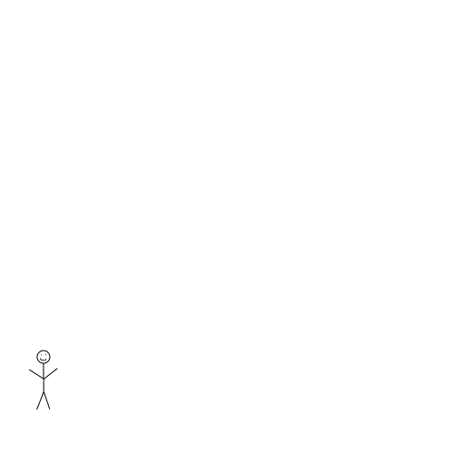

# stats220

## dnie495

This is the stats220 repository for my Assignments this semester 1 2022. 

This assignment required completion of 2 sections:

1. Part A - creation of a meme

2. Part B - creation of a gif

The repo includes 5 files

1. README.md
2. index.md
3. my_meme.png
4. index.html
5. flip_gif.gif
6. index.Rmd (code for markdown)

**Here is the link to the *Part A's* Github Page**

**https://shakenrobot.github.io/stats220/**
