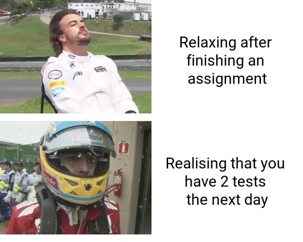

# dnie495 Assignment 1 meme


- This is my meme for the stats220 Assignment 1. I follow formula 1 as hobby so I decided to incorporate that into the assignment. 

- I made this meme because I think it's relatable for many uni students (myself included) that leave things to the last minute.

- The images are of formula 1 driver Fernando Alonso.

Here is a link to the [Formula 1 site](https://www.formula1.com/) if you are interested in learning about formula 1.

### Inspiration

When I looked up meme templates the first that came up was the drake template below


This was the main inspiration for my template.

To make it new/original I adapted the format to f1 and switched the reactions around. 

## meme code

The R code to create the meme is below

```
library(magick)
library(tidyverse)


first_image  <- image_read("https://d3cm515ijfiu6w.cloudfront.net/wp-content/uploads/2020/05/18123325/Fernando-Alonso-deckchair.jpg") %>% image_scale(500)
second_image <- image_read("https://d3cm515ijfiu6w.cloudfront.net/wp-content/uploads/2020/02/10114608/Fernando-Alonso.png") %>% image_scale(500)

text1 <- image_blank(width = 500, height = 400, color = "#FFFFFF") %>% image_annotate(text = "Relaxing after \nfinishing an \nassignment",
                                                                                      color = "#000000",
                                                                                      size = 50,
                                                                                      font = "Roboto",
                                                                                      gravity = "center")
text2 <- image_blank(width = 500, height = 400, color = "#FFFFFF") %>% image_annotate(text = "Realising that you \nhave 2 tests \nthe next day",
                                                                                      color = "#000000",
                                                                                      size = 50,
                                                                                      font = "Roboto",
                                                                                      gravity = "center")
top_row_image_and_text <- c(first_image, text1)
bottom_row_image_and_text <- c(second_image, text2)

top_row <- image_append(top_row_image_and_text)
bottom_row <- image_append(bottom_row_image_and_text)

meme <- c(top_row, bottom_row) %>% image_append(stack = TRUE) %>% image_scale(600)

meme 
image_write(meme, path = "my_meme.png")
```
